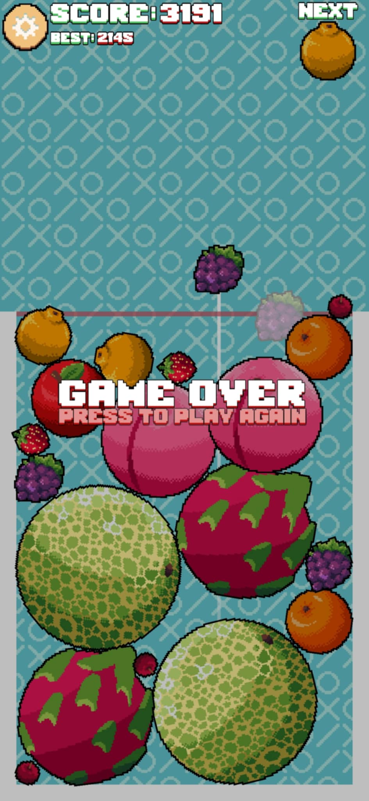

# Suika-Pixel
Project was carried out as part of the student scientific circle "Ruch Projektantów Gier" at Poznań University of Technology.

## General Information
This project is a solo developed game using Godot 4.2. The game is based on a popular video game called "Suika Game", also known as "Watermelon Game". The project is currently in progress, but the current working version can be downloaded from the export folder.

## Project presentation
